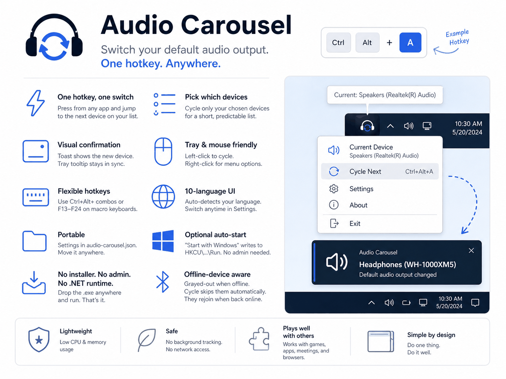

# Audio Carousel

[English](README.md) | [日本語](README.ja.md) | [简体中文](README.zh-Hans.md)



A lightweight Windows tray utility that switches the system default audio
output device through a list you choose, with a single global hotkey.

Inspired by [PeekDesktop](https://github.com/shanselman/PeekDesktop): no
installer, single executable, portable configuration.

---

## Features

- **One hotkey, one switch.** Press your hotkey from any app — game,
  meeting, browser — and the system default audio output jumps to the
  next device on your list. No need to open the Sound settings panel.
- **Pick exactly which devices to cycle.** A typical Windows PC —
  desktop or laptop — exposes many outputs: the motherboard or chassis
  analog jacks (speakers, headphone-out, line-out), monitor audio
  routed over DisplayPort or HDMI, USB DACs and headset dongles, every
  Bluetooth headset ever paired, virtual audio cables, and so on.
  Audio Carousel only rotates through the ones you selected, so the
  cycle stays short and predictable.
- **Visual confirmation.** A toast appears at the bottom-right of the
  active monitor showing the new device's name. The tray icon's tooltip
  also reflects the current device.
- **Tray-resident, mouse-friendly.** Left-click the tray icon to cycle
  (same as the hotkey). Right-click for a menu that lists your devices —
  click one to switch to it directly, plus Cycle next, Settings, About,
  Exit.
- **Flexible hotkeys.** Modifier combinations (`Ctrl+Alt+A`) and the
  rarely-used function keys (`F13`–`F24`, common on programmable
  keyboards and macro pads) all work.
- **10-language UI.** English, 日本語, 简体中文, 繁體中文, Español,
  Français, Deutsch, Português (Brasil), Русский, 한국어. Auto-detects
  from your Windows display language; switch manually any time in
  Settings.
- **Plain-text JSON config.** Settings live in `audio-carousel.json`
  next to the .exe. Open it in any text editor to see exactly what's
  saved, change a hotkey or device name without launching the UI,
  version-control it with git, or generate it from a script. The
  Settings window just edits the same file.
- **Optional auto-start.** "Start with Windows" writes only to the
  current user's `HKCU\...\Run` key — no admin rights, no service, no
  scheduled task.
- **No installer, no admin, no .NET runtime.** Drop the .exe in any
  folder and run it. Self-contained build means you don't have to
  install anything else.
- **Offline-device aware.** Devices that are unplugged, powered off, or
  not currently connected appear grayed out in Settings; the cycle
  skips them automatically. This is especially handy for Bluetooth
  headphones — leave them in the cycle list permanently, and they'll
  rejoin the rotation only when they're actually connected.

## Download and run

1. Download `AudioCarousel.exe` from the
   [Releases](https://github.com/kai-rin/audio-carousel/releases) page
   and put it in any folder you like (e.g.
   `C:\Tools\AudioCarousel\`).
2. Double-click to launch.

   > **First-run note:** because the binary is unsigned, Windows
   > SmartScreen may show "Windows protected your PC". Click
   > **More info → Run anyway**. Alternatively, before launching:
   > right-click the .exe → **Properties** → check **Unblock** → **OK**.
   > See *Disclaimer* below for why this happens.

3. The tray icon appears (near the clock) and the **Settings** window
   opens automatically on first run.

## First-time setup

In the Settings window:

1. **Add the audio outputs you want to cycle.** Click *Add device* and
   pick from the dropdown. Typical choices: speakers, headset, HDMI TV,
   Bluetooth earbuds. Two devices is enough to make the hotkey useful.
2. **Reorder if you like.** Use *Move up* / *Move down* to set the
   cycle order.
3. **Set a hotkey.** Click the hotkey field and press the keys you
   want — e.g. `F16`, `Ctrl+Alt+A`, `Win+Shift+S` (use anything not
   already taken). Click *Clear* to remove.
4. **(Optional) UI language.** Defaults to *Auto* (follows Windows). Pick
   a specific language if you prefer.
5. **(Optional) Start with Windows.** Tick the checkbox to launch Audio
   Carousel automatically when you sign in.
6. Click **OK**.

## Daily use

- **Press the hotkey** from any app → audio jumps to the next device
  on your list. A toast at the bottom-right of the active monitor
  confirms the switch.
- **Left-click the tray icon** does the same as pressing the hotkey.
- **Right-click the tray icon** for the menu:
  - **Your registered devices** — the current one is checked; click any
    other to switch to it directly (offline devices are grayed out)
  - **Cycle next** — same as hotkey
  - **Settings** — reopen the settings window
  - **Start with Windows** — toggle without opening Settings
  - **About** — version info
  - **Exit** — quit the app

## Configuration and data location

- **Settings file:** `audio-carousel.json` in the same folder as the
  .exe. Edit it by hand if you like, or just use Settings.
- **Registry:** the only write is to
  `HKCU\Software\Microsoft\Windows\CurrentVersion\Run` when
  *Start with Windows* is on. Turning it off removes the entry. Only the
  current user is affected. No admin rights are required.
- **No background services, no scheduled tasks, no telemetry.** The
  app is just the one .exe.

## Uninstall

1. Right-click the tray icon → **Settings** → uncheck *Start with
   Windows* → **OK** (this removes the registry entry).
2. Right-click the tray icon → **Exit**.
3. Delete the folder containing `AudioCarousel.exe` and
   `audio-carousel.json`.

If you skip step 1, you can also clean up later by deleting the
`AudioCarousel` value under
`HKCU\Software\Microsoft\Windows\CurrentVersion\Run` in `regedit`.

## System requirements

- Windows 10 1809 or later, or Windows 11
- x64
- No admin rights required
- No .NET runtime required (self-contained build)

## Disclaimer

Audio Carousel calls `IPolicyConfig`, an undocumented Windows COM
interface, to switch the default audio endpoint. This is the same
technique used by many similar tools (SoundSwitch, EarTrumpet, NirCmd,
...) and has been stable from Windows Vista through Windows 11. However,
since the API is unofficial, Microsoft could change or remove it in a
future Windows update without notice. If a future Windows update breaks
Audio Carousel, please open an issue.

The released binary is not code-signed (code-signing certificates carry
an ongoing cost, and we've held off on adopting one while the project
remains free). Windows SmartScreen will warn on first launch until the
binary's reputation builds up — see the *First-run note* under
*Download and run*.

## Security

See [SECURITY.md](SECURITY.md) for the threat model and how to report
security issues.

## License

[MIT](LICENSE) — © 2026 Kairin.
Bundled third-party components and their licenses are listed in
[THIRD_PARTY_NOTICES.md](THIRD_PARTY_NOTICES.md).

---

# For developers

Everything below is for building from source. End users do not need any
of this — just download the release binary above.

## Tech stack

- C# / .NET 9 / WinForms (`net9.0-windows`)
- xUnit for tests
- `NAudio.Wasapi` (`NAudio.CoreAudioApi` namespace) plus an inline
  `IPolicyConfig` COM declaration in `src/AudioCarousel/Audio/`

## Build and test

Requires the .NET 9 SDK on Windows.

```bash
dotnet build
dotnet test
dotnet format          # fixes whitespace/EOL per .editorconfig
```

## Publish single-file executable

```powershell
pwsh ./scripts/publish.ps1
```

Output: `publish/AudioCarousel.exe` (~108 MB, self-contained).

`scripts/publish.ps1` is the **only** supported way to produce a
release exe. The flags are deliberately tuned; do not assemble
`dotnet publish` arguments by hand.

> **Binary size note.** Windows Forms is incompatible with NativeAOT
> (`NETSDK1175`), and trimming strips runtime COM interop machinery
> that `NAudio.CoreAudioApi` depends on. The script therefore uses an
> untrimmed self-contained JIT single-file publish. The ~108 MB size is
> the price of "drop the .exe anywhere and run, no .NET runtime
> needed" — this tradeoff was made deliberately.

## Project layout

See [CLAUDE.md](CLAUDE.md) for the architecture map, conventions, and
critical gotchas (don't enable AOT/trimming, atomic config writes,
test isolation rules, etc.). Design notes live under
`docs/superpowers/specs/`.

